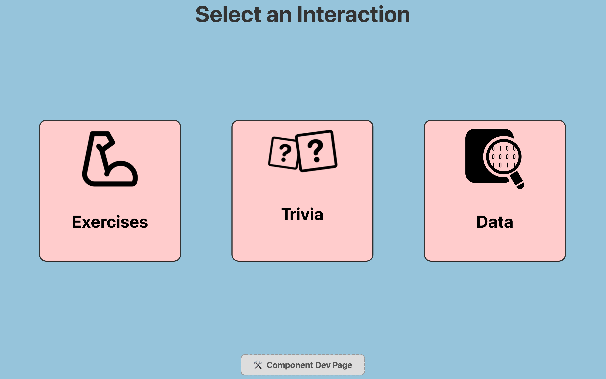
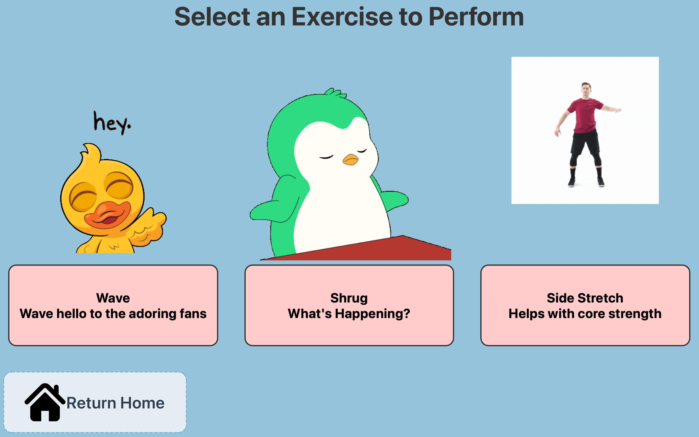
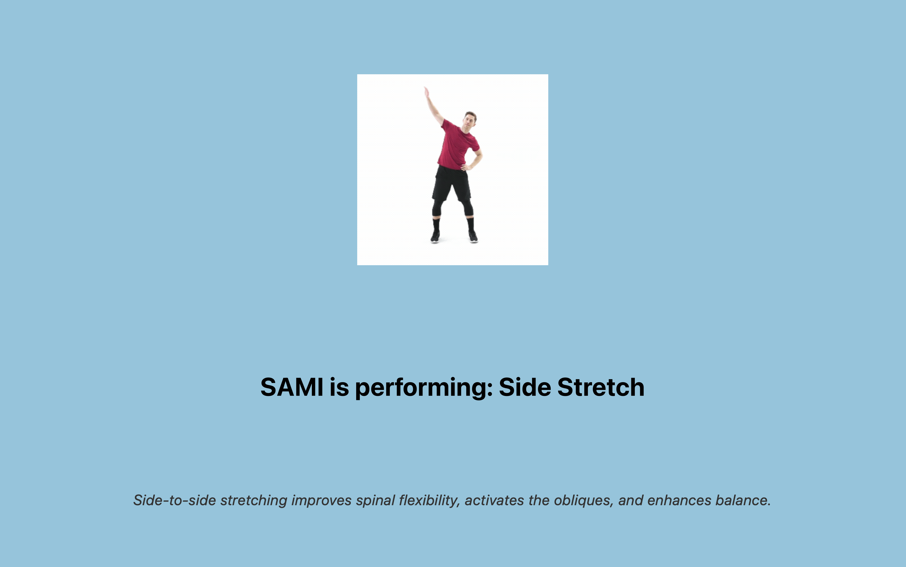
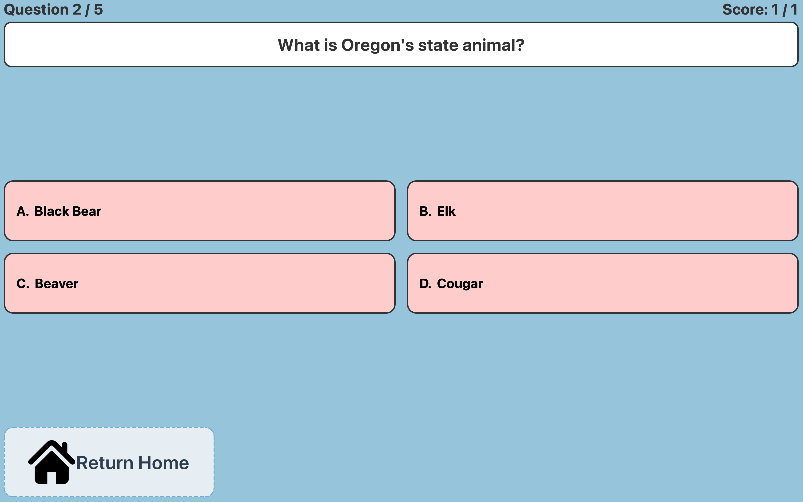
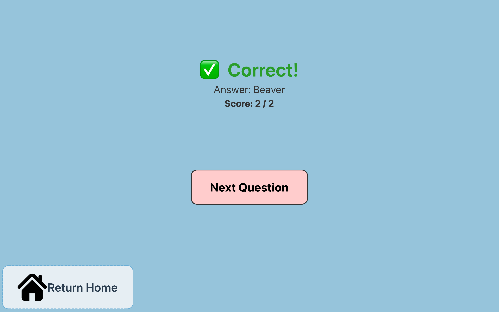
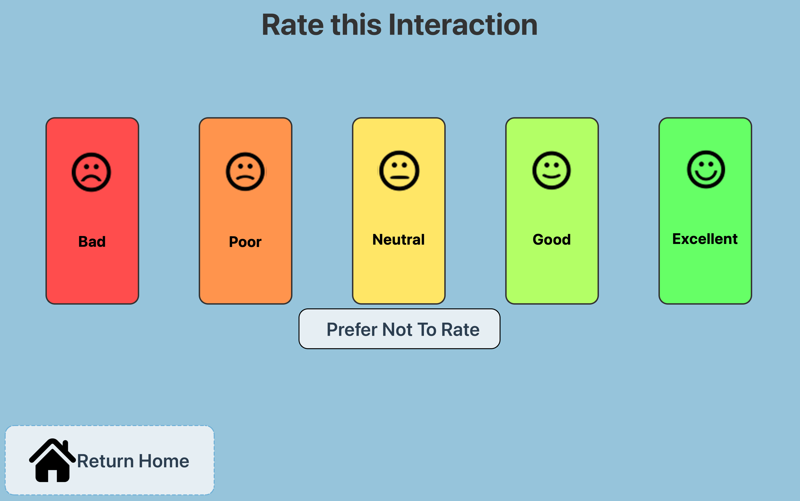

# SAMI GUI Software Documentation

## Table of Contents
1. [Quick Start](#quick-start)
2. [New System Requirements](#system-requirements)
3. [Installation](#installation)
4. [Project Structure](#project-structure)
5. [Running the GUI](#running-the-gui)
6. [GUI Pages Overview](#gui-pages-overview)
7. [Rating & Data System](#rating--data-system)
8. [Trivia System](#trivia-system)
9. [Adding New Features](#adding-new-features)
10. [GUI Look](#gui-look)
11. [Old Software Documentation](#old-sami-software-documentation)

All previous GUI commits are found in the [SAMI Presentation Repo](https://github.com/Mitokongdrya/SAMI_Presentation.git)  

---

## Quick Start

```bash
# Install dependencies
pip install -r requirements.txt

# Run the GUI
python SAMI_UI.py
```

The GUI will start in **presentation mode** by default, showing the full interactive interface with exercises, trivia, and data pages.

---

## System Requirements

- **Python**: 3.8 or later
- **OS**: Windows, macOS, or Linux
- **Hardware**: USB/Serial connection to SAMI Arduino
- **PyQt6**: 6.5+
- **Serial Library**: pyserial 3.5+

---

## Installation

### 1. Clone the Repository
```bash
git clone https://github.com/Mitokongdrya/SAMI_Presentation.git
cd SAMI-Robot/software
```

### 2. Create a Virtual Environment (Recommended)
```bash
python -m venv sami_env
source sami_env/bin/activate  # macOS/Linux
# or
sami_env\Scripts\activate  # Windows
```

### 3. Install Dependencies
```bash
pip install pyqt6
pip install pyserial
```
Do not currently use `pip install -r requirements.txt`, it does not currently work

### 4. Configure Serial Port
The default serial port is `/dev/tty.usbserial-10` (macOS). To change it:

Edit `SAMI_UI.py`, line ~320:
```python
window = SAMIControlUI(
    audio_folder="audio",
    starting_voice="Matt",
    arduino_port="/dev/tty.usbserial-10"  # ← Change this
)
```

**Common ports:**
- **macOS**: `/dev/tty.usbserial-10` or `/dev/tty.USBSERIAL`
- **Linux**: `/dev/ttyUSB0` or `/dev/ttyACM0`
- **Windows**: `COM3` or `COM4`

### 5. Run the GUI
```bash
python SAMI_UI.py
```

---

## Project Structure

```
software/
├── SAMI_UI.py                    # Main application window & orchestration
├── SAMIControl.py                # Robot serial communication & behavior playback
├── audio_manager.py              # Audio playback handler
├── audio_group.py                # Audio file grouping utility
│
├── components/                   # Reusable UI components
│   ├── page_title.py            # Page header titles
│   ├── action_button.py         # Large interactive buttons
│   ├── icon_nav_button.py       # Navigation buttons with icons
│   ├── home_button.py           # Styled "Return Home" button
│   ├── button.py                # Generic styled button
│   ├── back_home_nav.py         # Back navigation bar
│   └── confirm_dialog.py        # Confirmation dialogs
│
├── pages/                        # Full page views
│   ├── HomePage.py              # Landing page with navigation
│   ├── ExercisePage.py          # Exercise selection & execution
│   ├── RatingPage.py            # User rating submission (1-5 stars)
│   ├── DevPage.py               # Component showcase for development
│   ├── data_page/
│   │   ├── DataPage.py          # Data hub (navigation)
│   │   ├── SensorDataPage.py    # Sensor video playback
│   │   └── RatingDataPage.py    # Rating history viewer
│   └── trivia_page/
│       ├── TriviaLandingPage.py      # Trivia mode selection (5 or 10 Q)
│       ├── TriviaQuestionPage.py     # Question display
│       ├── TriviaAnswerPage.py       # Correct/wrong feedback
│       └── TriviaScorePage.py        # Final score & rating button
│
├── styles/
│   └── theme.py                 # Centralized design tokens & colors
│
├── behaviors/                    # Behavior JSON files
│   ├── Wave.json
│   ├── Shrug.json
│   └── ... (robot motion definitions)
│
├── audio/                        # Voice audio files
│   ├── hello_Matt.mp3
│   └── ... (voice_speaker.mp3)
│
├── icons/                        # UI images & animations
│   ├── Waving.gif
│   ├── Shrug.gif
│   └── ... (exercise preview GIFs)
│
├── Joint_config.json            # Joint ID mappings
├── Emote.json                   # Facial expression codes
├── requirements.txt             # Python dependencies
└── README.md                    # This file
```

---

## Running the GUI

### Presentation Mode (Default)
```bash
python SAMI_UI.py
```

Full interactive UI with:
- Exercise selection & execution
- Trivia quiz system
- User rating system
- Data viewing pages

### Legacy Debug Mode
To switch to the old debug interface, edit `SAMI_UI.py`, line ~47:
```python
USE_NEW_UI = False  # Toggle to True for presentation mode
```

---

## GUI Pages Overview

### **Home Page**
- Landing page with 4 navigation buttons
- **Exercises**: Exercise selection & performance
- **Trivia**: Quiz mode
- **Data**: View ratings and sensor data
- Built with modular `IconNavButton` components

### **Exercise Page**
- Displays 3 available exercises as GIF previews
- Click exercise card to start behavior
- Shows overlay with exercise name, video, and why-it-matters text
- After completion, rates the exercise on a 1-5 scale

### **Exercise Overlay**
- Full-screen modal during behavior execution
- Displays animated GIF of the exercise
- Shows description of benefits
- Disabled during robot motion

### **Trivia System** (4 pages)
1. **Trivia Landing**: Select 5 or 10 questions
2. **Question Page**: Display question with 4 multiple-choice answers
3. **Answer Page**: Show correct/wrong feedback with explanation
4. **Score Page**: Final score, "Rate & Finish" button transitions to rating

### **Rating Page**
- 5 emoji buttons (😢 → 😄) for user ratings (1-5)
- "Prefer Not To Rate" option
- Saves `timestamp | interaction | rating | trivia_score` to `interaction_ratings.txt`

### **Data Pages**
- **Data Hub**: Navigation to sensor data or rating history
- **Sensor Data**: Video playback of robot sensor feeds
- **Rating Data**: Table viewer of all ratings with per-exercise averages

---

## Rating & Data System

### Rating Storage
Ratings are appended to `interaction_ratings.txt` in 4-column format:

```
2026-03-13 14:30:45 | Exercise Name | 5 | 7/10
2026-03-13 14:31:22 | Trivia | 4 | 8/10
```

**Columns:**
1. **Timestamp**: ISO format date/time
2. **Interaction**: Exercise name or "Trivia"
3. **Rating**: 1-5 scale (or empty if "Prefer Not To Rate")
4. **Trivia Score**: Score fraction (e.g., "7/10") if rated after trivia, else empty

### Viewing Data
- **Rating Data Page**: Table with all ratings + per-exercise averages
- Backward-compatible: Old 3-column entries still parse correctly

---

## Trivia System

### Trivia Data Storage

**Trivia questions** (`showcase_trivia.csv`):
```csv
question,option_a,option_b,option_c,option_d,correct_answer
"What is the capital of France?","London","Paris","Berlin","Rome","Paris"
...
```

**Trivia scores** (`trivia_scores.txt`):
```
2026-03-13 14:35:00 | 8/10 | 80%
2026-03-13 14:40:15 | 5/10 | 50%
```

### Trivia Flow

1. **Trivia Landing**: User selects 5 or 10 questions
   - `trivia_load_questions(limit)` shuffles the CSV
   
2. **Question Page**: Display current question + 4 options
   - User clicks A, B, C, or D
   
3. **Answer Page**: Show result + explanation
   - Green (✓) if correct, Red (✗) if wrong
   - Auto-advance in 3 seconds
   
4. **Score Page**: Final score with "Rate & Finish" button
   - Saves to `trivia_scores.txt`
   - Sets `last_trivia_score_str` for rating context
   - Navigation to rating page

### Adding More Trivia Questions

Edit `showcase_trivia.csv`:
```
question,option_a,option_b,option_c,option_d,correct_answer
"New question?","Wrong1","Correct","Wrong2","Wrong3","Correct"
```

The system automatically shuffles and caps questions based on user selection.

---

## Adding New Features

### 1. Add a New Page
1. Create `pages/NewPage.py`:
   ```python
   from PyQt6.QtWidgets import QWidget, QVBoxLayout
   from components.page_title import PageTitle
   
   class NewPage(QWidget):
       def __init__(self, parent_ui):
           super().__init__()
           self.parent_ui = parent_ui
           layout = QVBoxLayout(self)
           layout.addWidget(PageTitle("New Page"))
   ```

2. Import in `SAMI_UI.py`:
   ```python
   from pages.NewPage import NewPage
   ```

3. Add to stack in `_initUI_new()`:
   ```python
   self.new_page = NewPage(self)
   self.stack.addWidget(self.new_page)
   ```

4. Add navigation button in `HomePage.py`:
   ```python
   btn = IconNavButton("New Feature", "icons/new_icon.png")
   btn.clicked.connect(lambda: self.parent_ui.stack.setCurrentWidget(self.parent_ui.new_page))
   ```

### 2. Add a New Reusable Component
1. Create `components/new_component.py`
2. Import and use in any page
3. Theme colors via `styles/theme.py`

### 3. Modify Theme Colors
Edit `styles/theme.py`:
```python
BG_APP = "#1a1a1a"           # App background
BG_BUTTON = "#2d2d2d"        # Button background
TEXT_PRIMARY = "#ffffff"     # Primary text
# ... etc
```

All pages automatically use the centralized theme.

## GUI Look
### Home Page


### Exercise Option Page


### Exercise Overlay Page


### Trivia Question Page


### Trivia Answer Page


### Rating Page


## Old SAMI Software Documentation
### System Requirement:
- Python 3.7 or later
- A computer connected to the SAMI (via USB/Serial)
- Operating System: Windows, macOS, or Linux

### Installation Instructions:
- Download or clone this project folder onto your local machine.
- To install the required Python packages run command: pip install pyqt5 pyserial playsound
- Default serial port is /dev/ttyUSB0 (Linux) or COM3 (Windows). Update in SAMI_UI.py.
- Open a terminal in the project folder run : python SAMI_UI.py

### What does the GUI do?
- Send Command: Select a joint, enter an angle and movement time, then send.
- Home: Instantly move all joints to their home positions. Use safely.
- To perform behavior just select a behavior (from the behaviors/  folder) and execute.
Motion (JointAngles)
Emotes (Expression)
Audio (AudioClip)

### Adding new Behaviors
- You can define new behaviors by creating JSON files inside the behaviors/ folder. Each behavior consists of keyframes that specify joint movements, emotes, audio clips, and wait times.
- For example see any .json file in behaviors/ folder.
- Steps to Add:
Create a JSON file with the structure above.
Save it in the behaviors/ folder (e.g., WaveHello.json).
Relaunch the GUI and the new behavior will appear in the dropdown menu.


## Troubleshooting Notes
Set "HasJoints", "HasAudio", and "HasEmote" to "True" or "False" for each frame.
"Joint" names must match those in Joint_config.json.
"Expression" names must match entries in Emote.json.
"AudioClip" should match the filename (without extension and voice suffix) in your audio/ folder.
For example, hello will look for hello_Matt.wav if Matt is your current voice.
No audio: Ensure .wav or .mp3 files match the expected filename pattern (e.g., hello_Matt.wav).
No response from robot: Check USB cable and serial port name in JamieUI.py

